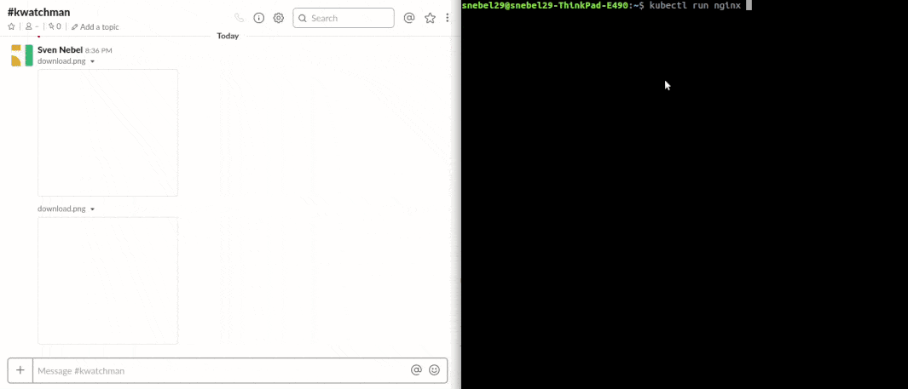

# Kwatchman
kwatchman is a tool to watch for k8s resources changes and trigger handlers

 - kwatchman leverages kubernetes watch and list endpoints to then pipe `Add`, `Update` and `Delete` events through a chain of built-in handlers
 - kwatchman remove event noise when configuring its diff handler, by filtering events that have no user changes on its manifest.
 - kwatchman provide manifest and free "payload" field to implement any handler, to do things like
    - Log events to stdout to enrich logging platform data for troubleshooting
    - Notify events to IM services such as Slack
    - Etc.

## Demo
Take a look on how would look like the combination of handlers: `diff` -> `log` -> `slack`, whenever there is a manifest change into the cluster kwatchman will compute the difference, will print the event into the standard output to finish by sending a notification to slack.

  

## Installation
kwatchman can work both internally and externally to the cluster, to work externally all you need as a valid kubeconfig file that kwatchman can leverage to connect although this is handy for development for production use cases you better deploy it within the cluster itself.

To install kwatchman in the cluster, you can use its helm chart

1. [Install helm](https://helm.sh/docs/using_helm/)
2. Install the chart, for now this have to be installed from your local file system, but will be published into https://github.com/helm/charts soon
```
$ git clone https://github.com/snebel29/kwatchman.git
$ cd kwatchman/build/chart/kwatchman
$ helm install -n kwatchman .
```

## Configuration
kwatchman requires a configuration file in order to work, it uses [viper](https://github.com/spf13/viper) under the hood to read the file therefore you can use any of its accepted formats such as (JSON, YAML, TOML, etc.)

The structure is pretty simple, a toml example is provided:

```toml
[[resource]]
kind = "deployment"

[[resource]]
kind = "service"

[[resource]]
kind = "statefulset"

[[resource]]
kind = "daemonset"

[[resource]]
kind = "ingress"

[[handler]]
name = "diff"

[[handler]]
name = "log"

[[handler]]
name = "ignoreEvents"
events = ["Add", "Delete"]

[[handler]]
name        = "slack"
clusterName = "myClusterName"
webhookURL  = "https://slack-webhook-url"
```

## Resources
Define the list of kubernetes resources to watch, not all resources are available to watch although the intention is to continuosly keep adding them.

> :information_source: You can create an issue or contribute yourself to get more resources added!

> :warning: Resources should handle apiGroup deprecation and removal transparently for the user when using last stable kwatchman versions


## Handlers
Handlers is what makes kwatchman powerfull and will be trigger in the specific order they are configured.

A handler takes as input all the related event information (kind of action, k8s manifest, payload, etc.) and execute some code using it, they also decide whether the next handler should run or not, and can pass new extra information through its payload `[]byte` field.

Handlers can be created for notifiying to instant message services such as Slack or to simply log the events into your logging system, currently only a hand of handlers are available but there is plans to allow building your own through plugins and generic hanlders such as webhooks and local executor.

### The diff handler
Diff handler clean manifest metadata and perform a diff comparison, the next handler is called only if a difference has been reported, it's typically the first handler to be trigger since this remove noise from events produced by status changes.

### The log handler
This can be used for testing and for recording events at any point in the chain, enriching your logging platform with high level events from kubernetes that could be leveraged for root cause analysis either by humans or machines by (AIOps)

### The ignoreEvents handler
Self explanatory, the events in the list will cause the chain to be stopped. There is `Add`, `Update` and `Delete` events only.

### The Slack handler
The slack handler notifies of an event using the payload of the handler as text, combined with the diff handler report changes into your manifests.

Have you ever being bitten in production by a change that a colleague never communicated? running this handler after the `diff` handler you will get notifications into your slack channel about any change in your cluster. 

In order to post messages with kwatchman to slack in a channel you have to 

1. [Create an slack application](https://api.slack.com/apps/new), you can call it `kwatchman`
2. Create an Incoming Webhook, the url will be use to configure kwatchman later on

Both steps are pretty much the same as if you follow [slack's hello world tutorial](https://api.slack.com/tutorials/slack-apps-hello-world)

## Compatibility matrix
Kwatchman uses [go-client](https://github.com/kubernetes/client-go) and a forked version of [kooper](https://github.com/snebel29/kooper) and it's therefore constrained to their version compatibility, new released may be required in order to fully work with future k8s versions, please check the compatibility matrix which is provided, any reported issue will be fixed in a best effor basis.

| kwatchman version | k8s version |
|:----------:|:-------------:|
| v1.0.0 |  +1.11 |

## Similar projects

- [kubewatch](https://github.com/bitnami-labs/kubewatch)
- [chowkidar](https://github.com/stakater/Chowkidar)

## Development
See [DEVELOPMENT.md](DEVELOPMENT.md)

## Coming soon

- Diff handler reporting semantic differences in a structure way
- Resource annotations policies, to for example don't report pod replicas changes, useful if deployment is controlled by pod autoscaler, but any policycould be implemented
- Webhook and local executor handler, to hand the execution chain to a local script or remote endpoint
- handler plugins, implement your own handlers, install and share them "à-volonté"
